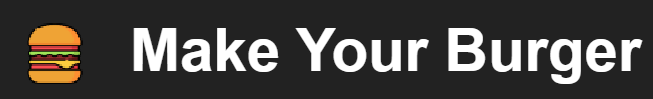

<h1 align="center">
  
</h1>

<h2 align="center" >Descrição do Projeto</h2>
<p align="center">
 Aplicação desenvolvida 
</p>
</br>
<p align="center">
  Desafio tem como principal objetivo realizar a conversão de uma aplicação que se encontra em JavaScript para Typescript.
</p>  

<h1 align="center">
  
</h1>

## 🔎 Features

- [x] Criar um novo prato.
- [x] Editar imagem, titulo, valor e descrição dos pratos.
- [x] Exclusão dos pratos
- [x] Deixar pratos disponiveis ou indisponiveis.

## :rocket: Tecnologias

Esse projeto foi desenvolvido com as seguintes tecnologias:

✔️ Vue.js

✔️ HTML

✔️ CSS

✔️ Axios

✔️ Json-Server

<h2>Pré-requisitos</h2>

Antes de começar, você vai precisar ter instalado em sua máquina as seguintes ferramentas:
[Git](https://git-scm.com) e [Node](https://nodejs.org/pt-br/).
Além disto é bom ter um editor para trabalhar com o código como [VSCode](https://code.visualstudio.com/).


# 👨‍💻 Rodando o Back End

```bash
# Clone este repositório
$ git clone https://github.com/gabriel-assana/Hamburgueria-VueJs
# Acesse a pasta do projeto no terminal/cmd
 cd Hamburgueria-VueJs
# Instale as dependências
$ npm install
# Execute a aplicação em modo de desenvolvimento
$ npm run server
# O servidor do back-end inciará na porta:8080 - acesse <http://localhost:8080>
```

# 👨‍💻 Rodando o Front End

```bash
# Acesse a pasta do projeto no terminal/cmd
$ cd GoRestaurant
# Abra um novo terminal e execute a aplicação em modo de desenvolvimento
$ yarn dev
# O servidor do front-end inciará na porta:3000 - acesse <http://localhost:3000>
